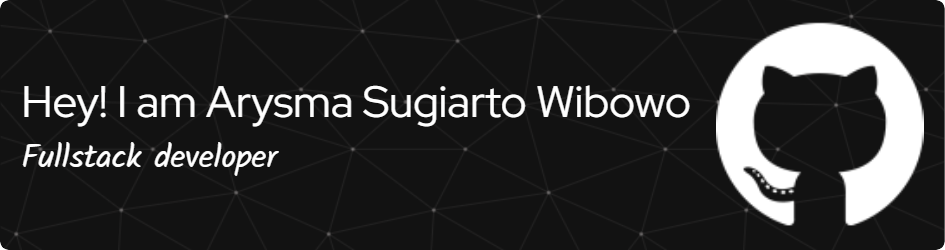

## 🌟Hey there! 👋 I'm Arysma Sugiarto Wibowo — thanks for stopping by my GitHub profile!👋

 

🔭 @ArysDevStudio_

🎨 A person deeply drawn to the world of art, who sees programming as a form of artistic expression.
To me, writing code is not just about solving problems—it’s about creating order, balance, and meaning.

“Art grows from code that is clean, structured, and harmonious.”

Life is a continuous process of learning, refining chaos, and leaving behind something thoughtful and beautiful—both in work and in character.

📬 Let’s connect:
📧 Email: arismana147@gmail.com

💬 WhatsApp: [Chat Me](https://wa.me/6282171737263)
###
<table align="center">
  <tr>
    <th>Kategori</th>
    <th>Teknologi</th>
  </tr>

  <!-- Frontend -->
  <tr>
    <td><b>Frontend</b></td>
    <td>
      
      
      
      
      
      
      
      
      
      
      
    </td>
  </tr>

  <!-- Backend -->
  <tr>
    <td><b>Backend</b></td>
    <td>
      
      
      
      
    </td>
  </tr>

  <!-- Framework -->
  <tr>
    <td><b>Framework</b></td>
    <td>
      
      
      
    </td>
  </tr>

  <!-- ORM -->
  <tr>
    <td><b>ORM</b></td>
    <td>
      
      
    </td>
  </tr>

  <!-- Database -->
  <tr>
    <td><b>Database</b></td>
    <td>
      
      
      
      
      
    </td>
  </tr>

  <!-- DevOps & OS -->
  <tr>
    <td><b>DevOps & OS</b></td>
    <td>
      
      
    </td>
  </tr>

  <!-- Tools -->
  <tr>
    <td><b>Tools</b></td>
    <td>
      
      
      
      
    </td>
  </tr>

  <!-- Version Control -->
  <tr>
    <td><b>Version Control</b></td>
    <td>
      
      
    </td>
  </tr>
</table>

Thanks for stopping by!
